---
title:
    - Variable stars
subtitle:
    - Naxxatra
author:
    - \href{mailto:jishnua511@gmail.com}{Jishnu P Das}
#date:
#    - '\faCalendar  \today'
header-includes:
    - '\defaultfontfeatures{Extension = .otf}'
    - '\usepackage{fontawesome}'
    - \input{theme1.tex}
numbersections: true
---

# Outline

- Variable stars
- Stellar Luminosity
- Forces inside a star
- Magnitudes and distances
- HR Diagram
- Roche Lobe
- Eclipsing binaries

---


# Variable stars

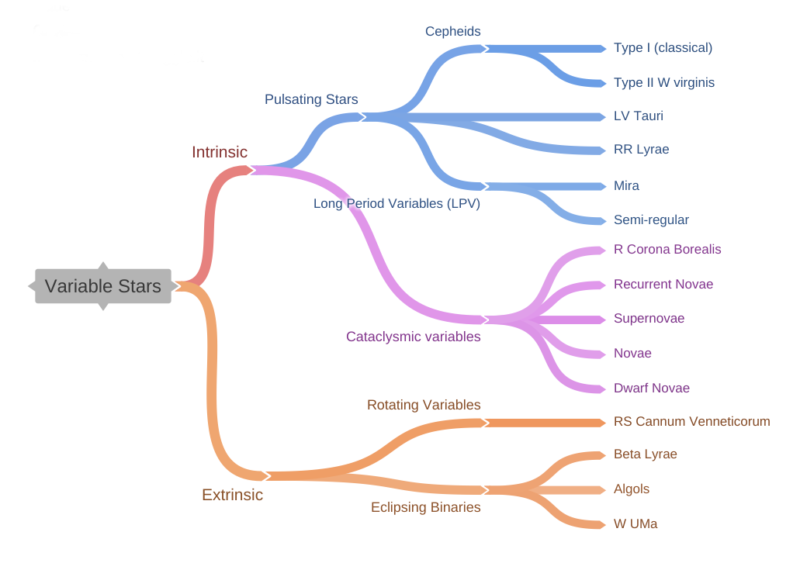


---


# The Brightness of a star
\framesubtitle{Luminosity}

## $$L = \sigma{T}^4 \times 4\pi{R}^2$$

- L : Luminosity
- $\sigma$ : Stefan-Boltzmann constant $5.670 \times {10}^{-8} W{m}^{-2}{K}^{-4}$
- T : Temperature
- $4\pi{R}^2$ : Area


---

# The Brightness of a star

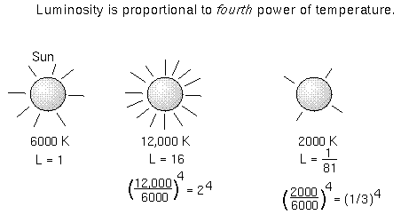

---


# Forces inside a star

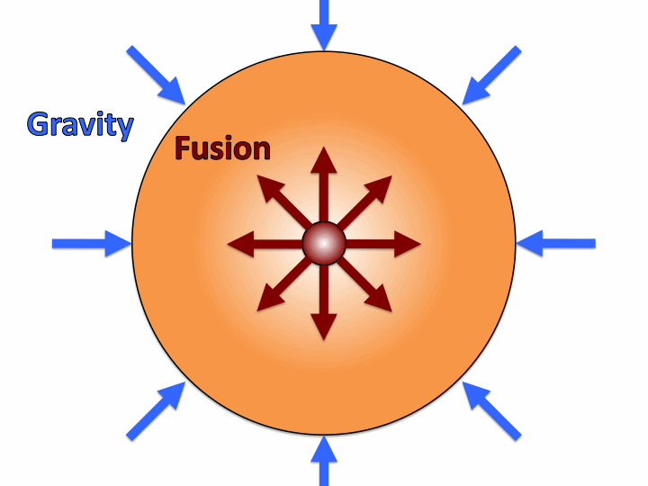

---


# Relationship between Mass and Luminosity

## $$\frac{L}{L_{\odot}} \approx\left(\frac{M}{M_{\odot}}\right)^{3.5}$$

If we define $M$ as the mass of the star in terms of solar masses, the above relationship can be simplified as follows

$$L \approx M^{3.5}$$

> Here $L_{\odot}$ and $M_{\odot}$ are the luminosity and mass of the sun.


---


# Intrinsic Variables

## Pulsating variables
- [Cepheids](https://en.wikipedia.org/wiki/Cepheid_variable#Classical_Cepheids)
- [RR Lyrae](https://en.wikipedia.org/wiki/RR_Lyrae_variable)
- Mira
- Semi-regular

---


# Cepheid variable
\framesubtitle{$\kappa $-mechanism}

- Doubly ionized helium (helium whose atoms are missing both electrons) is more opaque than singly ionized helium. 
- The more helium is heated, the more ionized it becomes. At the dimmest part of a Cepheid's cycle, the ionized gas in the outer layers of the star is opaque \footnote{$\kappa $ (kappa) gas opacity.}, 
- and so is heated by the star's radiation, and due to the increased temperature, begins to expand. 
- As it expands, it cools, and so becomes less ionized and therefore more transparent, allowing the radiation to escape. 
- Then the expansion stops, and reverses due to the star's gravitational attraction. The process then repeats.

---


# Cepheid variable

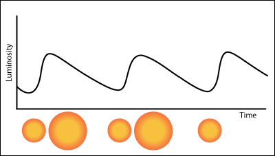

---


# Cepheid variables


---


# Magnitudes

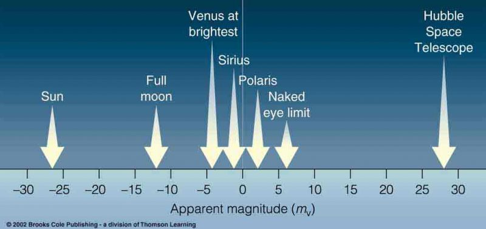

---


# Magnitudes

## Apparent magnitude
magnitude measured by an observer on earth

## [Absolute magnitude](https://en.wikipedia.org/wiki/Absolute_magnitude)
Apparent magnitude of an object at a distance of 10 [`parsecs`](https://en.wikipedia.org/wiki/Parsec) \footnote{1 pc $\approx$ 3.26 lightyears} or 32.6 ly

---


# Magnitudes and distances

### $$100^{\frac{m-M}{5}}=\frac{F_{10}}{F}=\left(\frac{d}{10 \mathrm{pc}}\right)^{2}$$

or in logarithmic terms the formula\footnote{This formula is called the distance modulus} can be written as

## $$M=m-5 \log _{10}\left(d_{\mathrm{pc}}\right)+5$$ 


---


# Extra Credits !!?

## Parallax 
- [Stellar Parallax (*youtube*)](https://youtu.be/SG7RfZoc2M8)
- [Parallax and Proper motion on the sky (*youtube*)](https://youtu.be/TXWuZSWtDPE)
<!--- [Another example](https://youtu.be/SG7RfZoc2M8)
- [https://youtu.be/MjC9Go0GPuo](https://youtu.be/MjC9Go0GPuo)-->

## A Quiz
[http://www.yusufahmed.com/gcse-astronomy-revision-page/](http://www.yusufahmed.com/gcse-astronomy-revision-page/)

# RR Lyrae Variables
\framesubtitle{A-F Spectral class with $\approx0.5M_{\odot}$}

- Periodic variable stars found mostly in Globular clusters
- They lie on the instability strip and pulsate via the $\kappa$-mechanism
- Exhibit a Period-Luminosity relationship in the Infrared K-band \footnote{K band is an atmospheric transmission window centered on 2.2 $\mu{m}$}
- Useful as standard candles inside the milkyway and globular clusters
- There are three main sub-types
    * **RRab** - most common type (91%), displays the steep rise and fall characterestic of the type
    * **RRc**  - less common (9%), shorter periods and more sinusoidal variation
    * **RRd**  - rare <1% , double-mode pulsators


---


# RR Lyrae Variables


---


# RR Lyrae Variables


---


# RR Lyrae Variables

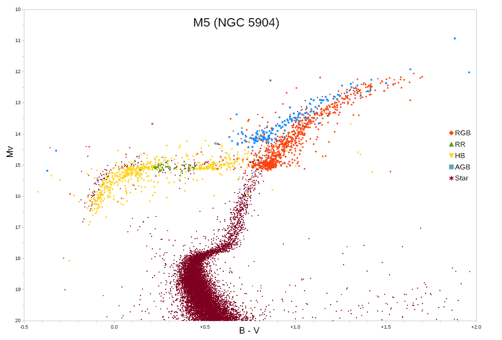


---


# Extrinsic Variables

## Eclipsing binaries
- EA - *Algols*
- EB - *$\beta$ Lyrae*
- EW - *W UMa*

## External links
- [```Summary```](https://www.boulder.swri.edu/~terrell/talks/aavso2001/frame00.html)

- [```Light Curves```](https://www.boulder.swri.edu/~terrell/talks/aavso2001/frame04.html)


---


# Roche Lobe

The Roche lobe is the region around a star in a binary system within which orbiting material is gravitationally bound to that star. It is an approximately tear-drop-shaped region bounded by a critical gravitational equipotential, with the apex of the tear drop pointing towards the other star (the apex is at the L1 Lagrangian point of the system).

---


# Roche Lobe

](graphics/Roche.png)

[```wiki```](https://en.wikipedia.org/wiki/Roche_lobe)

---


# Binaries

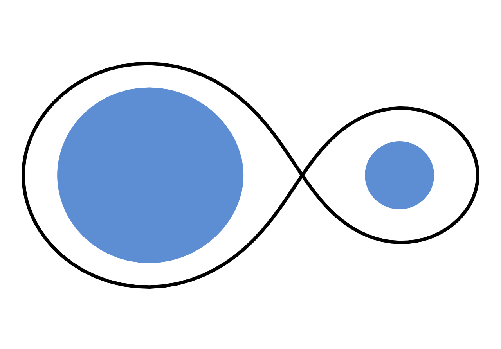

---


# Binaries

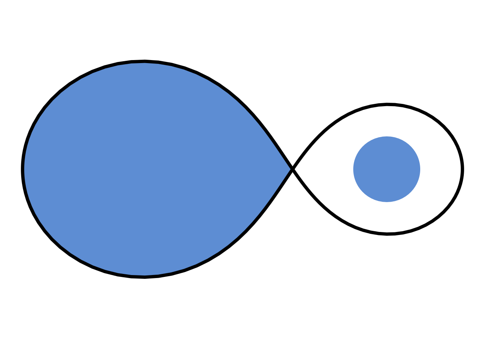

---


# Binaries

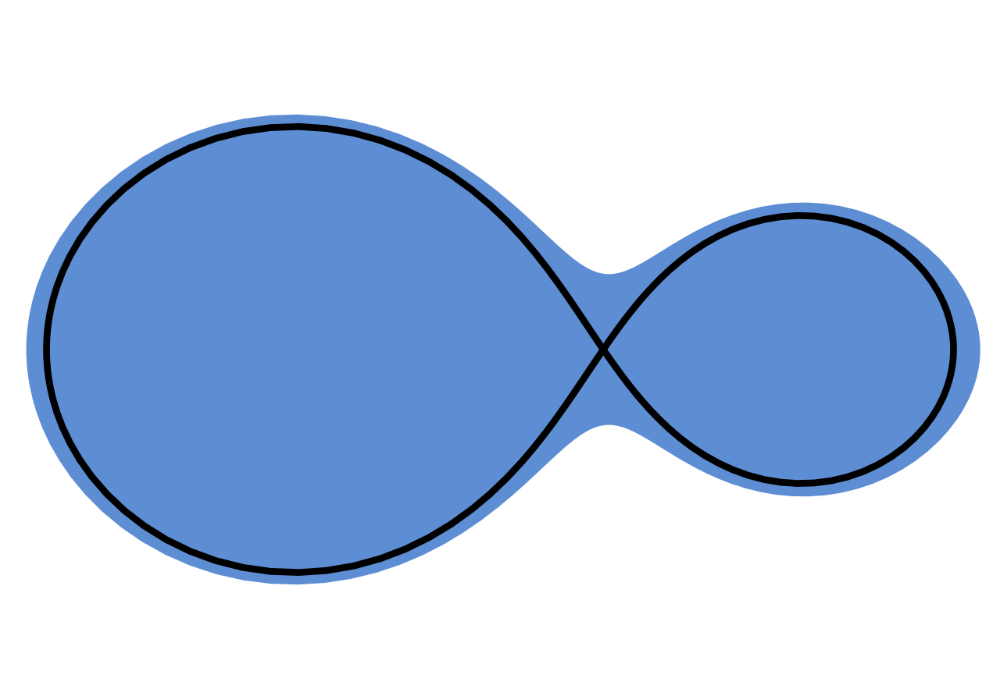

---


# [Algols (EA)](https://en.wikipedia.org/wiki/Algol_variable)

- Semi-detached binary system where primary is an early type main sequence star which doesn't fill its Roche lobe
- The secondary is a less massive cooler and fainter star which lies above the primary on the HR Diagram (it has also filled its Roche lobe)
- They are typically close binaries and hence the periods are typically in the range of a few hours to days.
- Some systems also exhibit period variations due to reasons like
    - Mass transfer
    - [*Applegate Mechanism*](https://ui.adsabs.harvard.edu/abs/1992ApJ...385..621A)
    - Presence of a third body

[```wiki```](https://en.wikipedia.org/wiki/Algol_variable)

---


# Algols

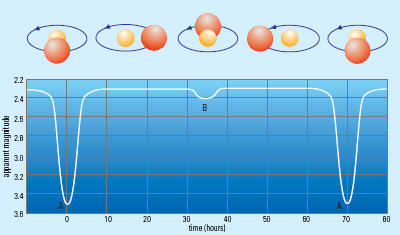

refer : [```animation```](http://www.vikdhillon.staff.shef.ac.uk/seminars/lives_of_binary_stars/algol.html)

---


# Algols
\framesubtitle{Algol paradox}

- In algol systems the secondary is more evolved than the primary, despite being less massive
- Conventional wisdom suggests that massive stars evolve faster than lighter stars
- This apparent violation of the evolutionary mechanics of stellar astrophysics is called the algol paradox
- The paradox is resolved in terms of mass transfer. The secondary was the massive star, but as it evolved (and expanded filling its Roche lobe) some of the mass was transferred to the primary star.

---


# Algol

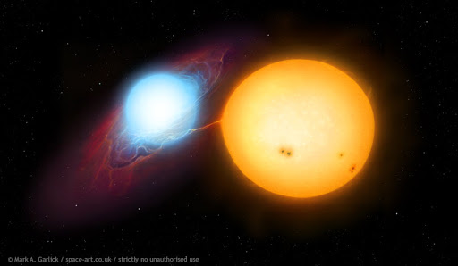


---


# $\beta$ Lyrae

- The two component stars of Beta Lyrae systems are quite heavy (several solar masses ($M_{\odot}$) each) and extended (giants or supergiants). 
- They are so close, that their shapes are heavily distorted by mutual gravitation forces: the stars have ellipsoidal shapes
- There are extensive mass flows from one component to the other. 
- Often there are accretion disks around secondary stars

---


# $\beta$ Lyrae

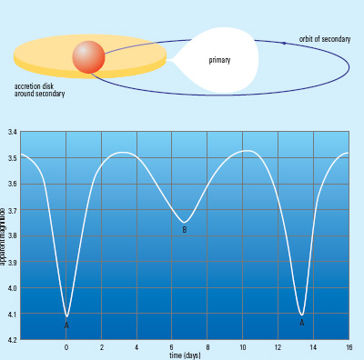

---


# $\beta$ Lyrae


[```animation```](https://commons.wikimedia.org/wiki/File:Beta_Lyrae-type_variable_binary_star_animation_3.gif)

---


# W UMa

- Overcontact systems with components of different mass but very similar temperatures
- Details of structure are not well-understood
- Asymmetries in light curves that change on short timescales 
- Exhibit long term period variations (ref algol section)

---


# W UMa

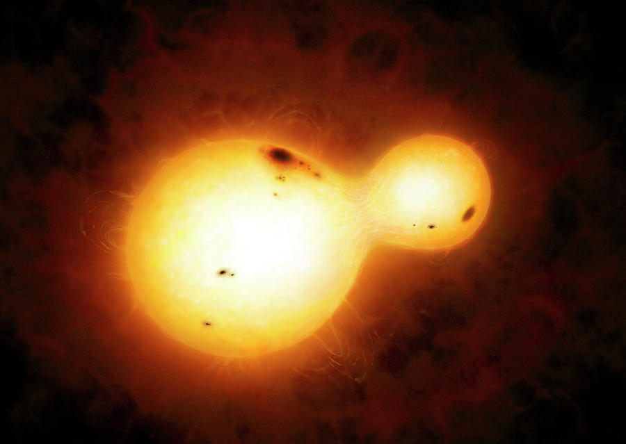

---


# W UMa


---

# Extra Credits

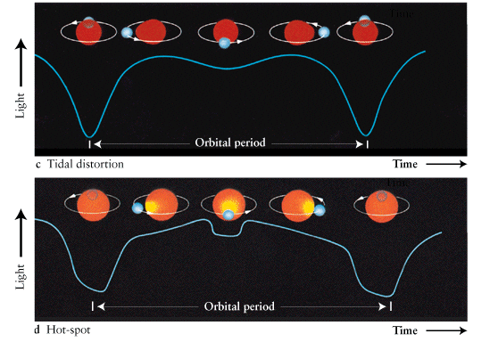

